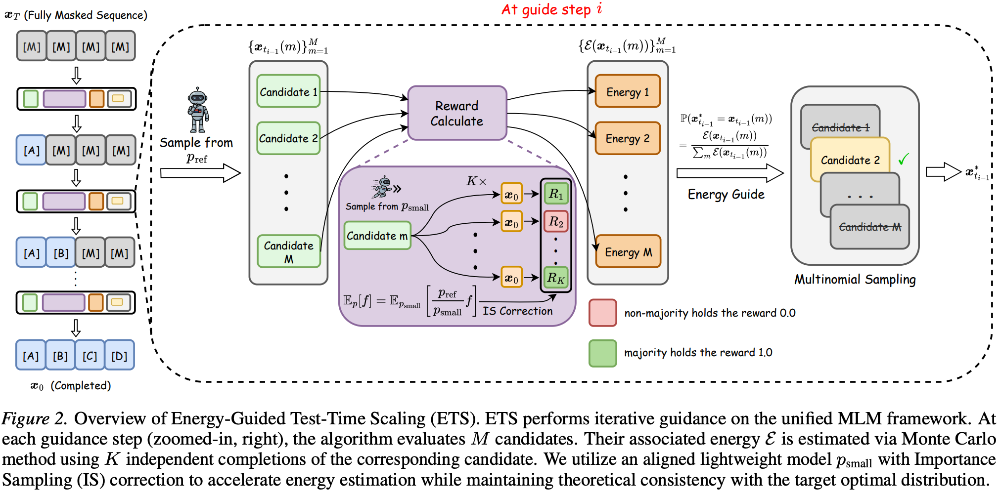

# ETS: Energy-Guided Test-Time Scaling for Training-Free RL Alignment

[](https://arxiv.org/abs/2601.21484)
[](https://zhuanlan.zhihu.com/p/2001982062979215914)
[](https://x.com/sheriyuo/status/2042072816712085577)

## News

### New works

- [2026.05.01] ETS is accepted as a poster at ICML 2026.
- [2026.01.29] We have uploaded ETS paper to [arXiv](https://arxiv.org/abs/2601.21484), and open-sourced ETS on [Github](https://github.com/sheriyuo/ETS)!

### New features in this repo

- [WIP] Support vllm and RL evaluations (AIME avg@32) & fix exist [lm-evaluation-harness](https://github.com/EleutherAI/lm-evaluation-harness) bugs.

## Introduction

We introduce **ETS (Energy-Guided Test-Time Scaling)**, a *training-free* inference method that samples directly from the **optimal RL policy** under a unified **Masked Language Modeling (MLM)** framework that covers both:
- **Autoregressive Models (ARMs)**
- **Diffusion Language Models (DLMs)**

**Core idea:**  
For RL objective, the optimal policy admits a closed-form structure. ETS leverages this to construct an *optimal transition kernel* that factorizes into:
- a **reference transition** given by a base model $p_{\mathrm{ref}}$, and  
- an **energy term** that is a conditional expectation of exponentiated rewards.



## Setup
Run the following script to setup environment.

```bash
git clone https://github.com/sheriyuo/ETS.git
cd ETS
pip install -e .
```

## Evaluation
### Hyperparameters you will tune

ETS compute is dominated by three hyperparameters:
- $M$: number of candidates per guidance step
- $K$: number of Monte Carlo estimation
- $I$: number of guidance steps

For evaluating **autoregressive models (Qwen)**, the ETS compute parameters map to:
- $M$: `m_candidates` 
- $K$: `k_monte_carlo`
- $I$ is **implicit** . It is determined by the total decoding length and block granularity:
  - `max_length` = total generation length $d_x$
  - `block_size` = block length $B$
  - so $I = \lceil \mathrm{max\_length} / \mathrm{block\_size} \rceil$

For evaluating **diffusion language models (LLaDA)**, the mapping is explicit:
- $I$: `guide_steps`
- $M$: `num_candidates`
- $K$: `monte_carlo_num` 

We evaluate in a pass@1 setting on:

- Math/Reasoning: MATH500, GSM8K

- Coding: HumanEval

- STEM: GPQA (Diamond)

### Autoregressive model

```bash
cd qwen
bash eval.sh
```

### Diffusion Language model

```bash
cd llada
bash eval.sh
```

## Citation

```bibtex
@inproceedings{li2026ets,
  title={ETS: Energy-Guided Test-Time Scaling for Training-Free RL Alignment},
  author={Xiuyu, Li and Jinkai, Zhang and Mingyang, Yi and Yu, Li and Longqiang, Wang and Yue, Wang and Ju, Fan},
  booktitle={Forty-third International Conference on Machine Learning},
  year={2026}
}
```
